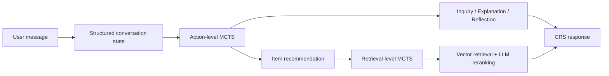
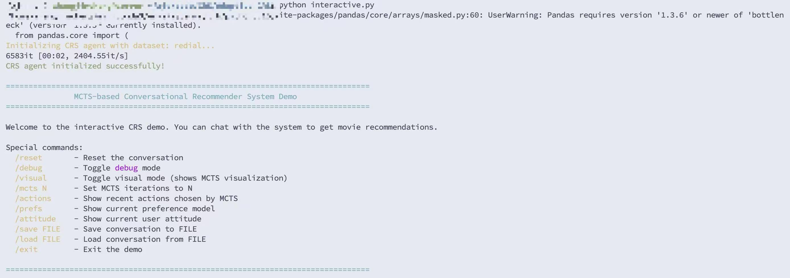

# DREAMS

Official implementation of **Towards Structured Context Modeling for Conversational Recommender Systems via Dual Monte Carlo Tree Search**.

DREAMS is a conversational recommender system (CRS) that maintains a structured user-preference state and uses two Monte Carlo Tree Search stages:

1. **Action-level MCTS** chooses whether to ask about preferences, recommend an item, explain a recommendation, or recover from a failed recommendation.
2. **Retrieval-level MCTS** refines the retrieval strategy before vector search and LLM reranking.

For efficiency, the first two real dialogue turns deliberately select preference-inquiry actions without simulation or backpropagation. Full MCTS starts on turn three.



## Features

- structured tracking of genres, actors, directors, user attitude, and recommendation history;
- dual MCTS for dialogue actions and recommendation retrieval;
- optional concurrent rollout simulations;
- browser-based, multi-turn interactive demo;
- live visualization of the search tree, rewards, feedback, and conversation state;
- ReDial and OpenDialKG data support;
- offline tests that do not call an external API.

## Path convention

All commands below must be run from the **repository root**, the directory containing this `README.md`:

```text
DREAMS_CRS/
├── README.md
├── requirements.txt
├── code/
├── data/
├── script/
└── tests/
```

Do not copy machine-specific absolute paths into commands, configuration files, or source code.

## Requirements

- Python 3.10 or newer;
- an OpenAI or OpenAI-compatible API endpoint;
- macOS, Linux, or Windows with a Bash-compatible shell for the provided `.sh` wrappers.

## Installation

```bash
git clone https://github.com/<YOUR_GITHUB_USERNAME>/DREAMS_CRS.git
cd DREAMS_CRS

python3 -m venv .venv
source .venv/bin/activate
python -m pip install -r requirements.txt
```

On Windows PowerShell, activate the environment with:

```powershell
.venv\Scripts\Activate.ps1
```

Configure credentials through environment variables. Never commit an API key.

```bash
export OPENAI_API_KEY="your-api-key"

# Optional: OpenAI-compatible gateway
export OPENAI_BASE_URL="https://your-endpoint.example/v1"

# Optional model overrides
export OPENAI_CHAT_MODEL="gpt-4o-mini"
export OPENAI_EMBEDDING_MODEL="text-embedding-ada-002"
```

The optional variables are documented in [`.env.example`](.env.example). The project reads environment variables directly and does not automatically load the `.env` file.

## Build the item embedding cache

The web demo and conversation entry points require a local item embedding cache. Generate it once for the dataset you intend to use:

```bash
# ReDial
python script/cache_item.py --dataset redial --batch_size 1000

# OpenDialKG
python script/cache_item.py --dataset opendialkg --batch_size 1000
```

Generated embeddings are stored at:

```text
save/embed/item/redial/
save/embed/item/opendialkg/
```

The `save/` directory is ignored by Git. Embedding generation calls the configured API and may incur provider charges.

## Interactive web demo

Start the local gateway:

```bash
python code/web_demo.py \
  --dataset redial \
  --mcts_iterations 6 \
  --simulation_workers 3
```

The command opens [http://127.0.0.1:8000](http://127.0.0.1:8000). The page provides:

- a multi-turn chat window for direct interaction with DREAMS;
- an independent in-memory CRS session for each browser conversation;
- the selected action for every real turn;
- a live action-search tree with visits, values, and average rewards;
- simulation, backpropagation, retrieval-reward, and feedback events;
- the current structured conversation state.

Useful options:

```bash
python code/web_demo.py --dataset opendialkg --port 8080
python code/web_demo.py --dataset redial --no_browser
```

The gateway binds to `127.0.0.1` by default and has no authentication. Do not expose it to a public network without adding authentication and HTTPS.

## Command-line conversation

The dataset arguments must use the following matching pairs:

| Data | `--dataset` | `--kg_dataset` |
|---|---|---|
| ReDial | `redial_eval` | `redial` |
| OpenDialKG | `opendialkg_eval` | `opendialkg` |

ReDial example:

```bash
python code/interactive_dreams.py \
  --dataset redial_eval \
  --kg_dataset redial \
  --crs_model mcts_dual \
  --mcts_iterations 3
```

During a session, enter `/prefs` to inspect the extracted preference state or `/exit` to stop.



## User-simulator evaluation

```bash
bash code/dual_chat_eval.sh \
  --dataset redial_eval \
  --kg_dataset redial \
  --crs_model mcts_dual \
  --mcts_iterations 3
```

Evaluation results are written below `save_<turn_num>/`. Human-interaction results are written below `save_human_<turn_num>/`. Both locations are ignored by Git.

The wrapper retries failed runs up to three times. Override its defaults when needed:

```bash
MAX_RETRIES=5 RETRY_DELAY=20 bash code/dual_chat_eval.sh \
  --dataset opendialkg_eval \
  --kg_dataset opendialkg
```

## MCTS parallelism

Sequential rollout is the default and should be used when reproducing paper results:

```bash
--simulation_workers 1
```

Use multiple workers when API latency dominates:

```bash
--mcts_iterations 6 --simulation_workers 3
```

Selection and expansion remain serial. Independent rollout simulations run concurrently on isolated mutable agent state, and backpropagation is merged serially. Provider rate limits and small iteration counts can limit the speedup; parallel completion order can also change request ordering.

## Standalone MCTS trace

Add `--trace` to the command-line conversation or simulator:

```bash
python code/interactive_dreams.py \
  --dataset redial_eval \
  --kg_dataset redial \
  --trace
```

The default output is `demo/mcts_trace.html`. Use `--trace_output PATH` to select another repository-relative or absolute output path, or `--no_trace_open` to generate the file without opening a browser.

## Repository structure

```text
code/
├── web_demo.py                  # local web-demo launcher
├── interactive_dreams.py        # human conversation entry point
├── chat_dual.py                 # LLM user-simulator evaluation
├── dual_chat_eval.sh            # evaluation wrapper
└── src/
    ├── cli.py                   # shared command-line arguments
    ├── web_gateway.py           # HTTP API and isolated sessions
    ├── web_demo.html            # dependency-free browser UI
    └── model/
        ├── agent.py             # data loading and conversation state
        ├── behavior.py          # dialogue actions, retrieval, reranking
        ├── action_mcts.py       # action-level MCTS
        ├── demo.py              # trace collection and HTML rendering
        ├── early_policy.py      # first-two-turn inquiry policy
        ├── parallel.py          # rollout concurrency helper
        ├── llm_client.py        # shared API client configuration
        └── chatgpt_mcts_dual.py # backward-compatible exports
data/                            # ReDial/OpenDialKG and processed splits
script/cache_item.py             # item embedding generation
tests/                           # offline unit and gateway tests
```

## Tests

The following checks do not make external API calls:

```bash
python -m unittest discover -s tests
python -m compileall -q code script data
bash -n code/dual_chat_eval.sh \
  script/redial/cache_item.sh \
  script/opendialkg/cache_item.sh
```

## Reproducibility

Record the chat model, embedding model, API endpoint implementation, dataset version, random seed, MCTS iteration count, and rollout worker count. The embedding model used at query time must match the model used to build the item cache.

## Data and license notice

This repository contains derived ReDial and OpenDialKG files. Verify the original datasets' licenses and redistribution terms before publishing or redistributing `data/`.

A project license has not yet been added. Add a `LICENSE` file before publishing the repository if you want to define reuse and redistribution terms for the code.

## Citation

If you use DREAMS in academic work, please cite the corresponding paper. A BibTeX entry can be added here after the publication metadata is finalized.
